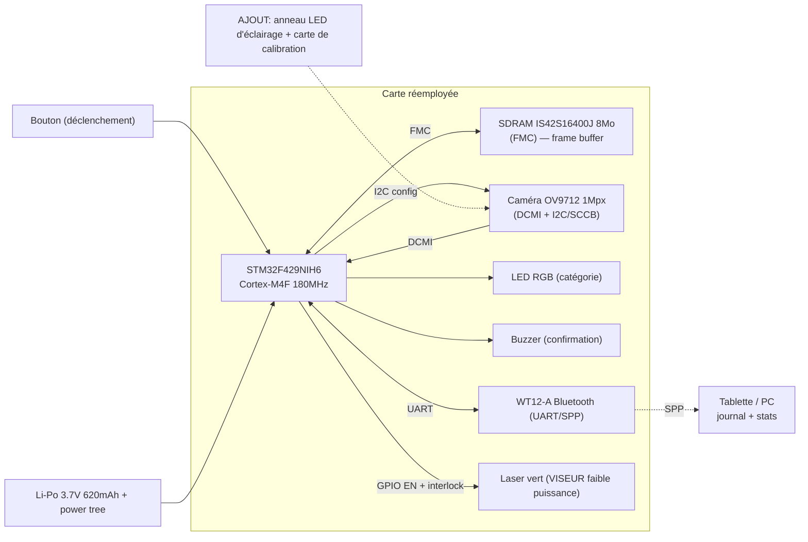

# Dossier de concept retenu — VisioTri

> Assistant portable de tri des matériaux par vision, issu du réemploi du FACOM SCANDIAG® (DX.TSCANPB).
> Document de justification complet — Phase 3 (idéation convergée) + cadrage Phase 4 (POC).
> Auteur : Yanis — Ynov Campus · Concours National Informatique × FACOM.

---

## 0. Note de cadrage (alignement concours)

Ce dossier est conçu pour alimenter directement les attendus du concours :

| Attendu / critère du concours | Où c'est traité ici |
|---|---|
| Concept retenu + justification | §1, §3 |
| Faisabilité (cohérence idée ↔ composants) | §5, §6, §9 |
| Richesse / pertinence RSE de l'idéation | §2, §11, §16 |
| Niveau d'aboutissement de la POC | §12 |
| Documentation des fonctions développées | §7, §8, §12 |
| Qualité du livrable (lu par un industriel) | structure et ton de tout le document |

Le matériel réutilisé est repris tel qu'identifié en Phase 1/2 (voir `docs/FICHE_TECHNIQUE.md`, `docs/PHASE2_CHAMP_DES_POSSIBLES.md`). Les valeurs marquées *[à confirmer]* dépendent de mesures sur carte non encore réalisées.

---

## 1. Synthèse exécutive

**VisioTri** transforme le SCANDIAG — un outil de diagnostic d'usure freins/pneus discontinué — en **assistant de poche d'aide au tri et à l'identification de matériaux**, destiné aux déchèteries, recycleries, ressourceries et lignes de tri de l'économie sociale et solidaire (ESS).

L'opérateur pointe l'appareil vers un objet ; la **caméra OV9712** capture la surface, le **STM32F429** réalise une analyse visuelle légère (couleur, brillance/texture, lecture du code d'identification résine, code-barres), et l'appareil annonce **instantanément une catégorie** via la **LED RGB** et le **buzzer**. Le détail (catégorie, confiance, horodatage) part en **Bluetooth** vers une tablette qui tient le **journal de tri** et produit des statistiques de flux.

Le parti pris technique, hérité directement de l'analyse Phase 2 (« IA embarquée lourde : écarter en V1 »), est une **classification par règles visuelles configurables** plutôt qu'un réseau de neurones lourd : c'est ce qui rend le concept **réellement faisable** dans l'enveloppe CPU/RAM/énergie de la carte, tout en restant améliorable (V2).

**Boucle RSE remarquable** : un produit destiné au rebut devient un outil qui **améliore le tri et le recyclage d'autres déchets**. Le message est lisible et fort pour la Direction RSE de FACOM.

---

## 2. Problème, terrain et utilisateurs

### 2.1 Le problème métier
Le tri en déchèterie / recyclerie repose massivement sur l'**œil et l'expérience** d'opérateurs. Les erreurs de tri sont coûteuses :
- un mauvais flux contamine un lot entier (un plastique non recyclable dans un bac PET déclasse le bac) ;
- la distinction visuelle de plastiques (PET vs PEHD vs PP vs PS) est difficile à l'œil nu ;
- la traçabilité des flux (combien de quoi a transité) est souvent absente ou saisie à la main.

Les outils de tri optique industriels (spectrométrie NIR sur convoyeur) existent mais coûtent des dizaines de milliers d'euros — **inaccessibles aux petites structures de réemploi**, qui sont précisément les acteurs RSE de terrain.

### 2.2 Personas
- **Opérateur de tri (recyclerie / ESS)** : a besoin d'une réponse binaire et rapide « ce bac ou cet autre », sans formation longue, avec un appareil robuste et nomade.
- **Responsable de site** : veut des **statistiques de flux** pour son reporting environnemental et l'optimisation des collectes.
- **Animateur / formateur** : utilise l'appareil comme support pédagogique pour expliquer les consignes de tri au public (les déchèteries font de plus en plus de sensibilisation).

### 2.3 Pourquoi un appareil de poche (et pas une caméra fixe)
Le SCANDIAG est **déjà** un boîtier portatif, autonome sur batterie, à un bouton, conçu pour être pointé sur une surface. Sa forme d'usage d'origine (poser/pointer sur un objet, appuyer, lire un voyant) **correspond presque trait pour trait** à l'ergonomie d'un assistant de tri. Le réemploi est donc cohérent jusque dans l'ergonomie, pas seulement dans l'électronique.

---

## 3. Justification du choix (faisabilité ↔ composants)

### 3.1 Adéquation matériel → fonction
| Besoin VisioTri | Bloc SCANDIAG qui le couvre | Adéquation |
|---|---|---|
| Voir l'objet | Caméra OV9712 1 Mpx + DCMI | Native, idéale |
| Traiter l'image | STM32F429 Cortex-M4F 180 MHz + FPU | Suffisant pour vision légère |
| Mémoriser une image | SDRAM IS42S16400J 8 Mo (FMC) | Large marge (2 Mo/trame) |
| Répondre à l'opérateur | LED RGB + buzzer | Réemploi direct, même rôle UI |
| Déclencher | Bouton multifonction | Réemploi direct |
| Remonter les données | WT12-A Bluetooth (SPP/UART) | Suffisant pour télémétrie texte |
| Fonctionner nomade | Li-Po 620 mAh + power tree | Suffisant (cf. §9) |
| Viser / cadrer | Laser vert (réaffecté en viseur) | Réemploi détourné, faible puissance |

Aucun bloc n'est « forcé » : chaque fonction de VisioTri tombe sur un bloc existant prévu pour un usage analogue. **C'est le cœur de l'argument de faisabilité.**

### 3.2 Pourquoi VisioTri plutôt que les autres pistes Phase 3
Trois familles ont été explorées (métrologie laser, kit pédagogique, tri par vision) :

| Critère | ScanRelief (métrologie) | EduVision (péda) | **VisioTri (tri)** |
|---|---|---|---|
| Faisabilité POC en 7h | Moyenne (triangulation + calibration) | Haute | **Haute** |
| Pertinence RSE | Bonne | Bonne | **Excellente (boucle recyclage)** |
| Adéquation matériel | Excellente | Excellente | **Excellente** |
| Différenciation / récit | Bonne | Moyenne | **Forte (produit RSE → outil RSE)** |
| Risque technique principal | Précision optique | Accès firmware | Robustesse classif (maîtrisable par règles) |

VisioTri maximise le couple **pertinence RSE × faisabilité**, qui est exactement l'axe d'évaluation du concours.

### 3.3 Honnêteté sur les limites (assumées)
- La classification par règles est **moins universelle** qu'un système NIR industriel : elle vise un **sous-ensemble de cas fréquents et utiles**, pas l'exhaustivité.
- La distinction fine des résines repose sur la **lecture du code d'identification** (triangle 1–7), parfois peu lisible (moulé, peu contrasté) → traité en feature à part, avec stratégie d'éclairage (§6.4) et statut V2 pour les cas durs.
- On revendique une **politique de rejet** : en cas de doute, l'appareil affiche « incertain » plutôt qu'une fausse catégorie. La confiance opérateur prime sur le taux de couverture.

---

## 4. Scénarios d'usage détaillés

### 4.1 Scénario nominal « tri plastique »
1. L'opérateur prend un flacon, le présente à ~15–20 cm de l'appareil.
2. Le **laser** matérialise le centre de visée ; l'opérateur cadre la zone du code résine.
3. Appui bouton → capture d'1 trame + (option) éclairage LED d'appoint.
4. Le firmware : segmente, calcule couleur/brillance, tente la lecture du code résine, éventuellement un code-barres.
5. Réponse en < 1 s :
   - **LED verte + 1 bip** : catégorie reconnue (ex. « PET — bac 2 »).
   - **LED bleue** : code-barres lu, catégorie issue de la base produit.
   - **LED orange + 2 bips** : incertain → tri manuel conseillé.
6. La ligne `{horodatage, catégorie, confiance}` part en Bluetooth vers la tablette.

### 4.2 Scénario « inventaire / statistiques »
En fin de session, la tablette agrège : volumes par catégorie, taux d'incertitude, débit (objets/h). Export CSV pour le reporting RSE du site.

### 4.3 Scénario « sensibilisation public »
Mode démonstration : l'animateur scanne des déchets apportés par le public, l'appareil annonce la bonne consigne → outil pédagogique de terrain.

---

## 5. Architecture matérielle

### 5.1 Schéma fonctionnel VisioTri



### 5.2 Inventaire « gardé / réaffecté / ajouté »
| Bloc | Statut dans VisioTri | Justification |
|---|---|---|
| STM32F429NIH6 | **Gardé** (cible firmware) | Cœur de traitement |
| OV9712 + DCMI | **Gardé** (même fonction : voir) | Capteur image natif |
| SDRAM IS42S16400J | **Gardé** (frame buffer) | 8 Mo, large marge |
| WT12-A Bluetooth | **Gardé** (télémétrie) | SPP suffisant pour du texte |
| LED RGB / buzzer / bouton | **Gardé** (UI quasi identique) | Même rôle qu'à l'origine |
| Li-Po + power tree | **Gardé** | Autonomie OK (§9) |
| Laser classe 3R | **Réaffecté** en viseur faible puissance | Aide au cadrage, pas de mesure |
| Anneau LED blanc d'appoint | **Ajout** (~qq €) | Stabilise la couleur sous éclairage variable |
| Carte de calibration (blanc/gris) | **Ajout** (impression) | Balance des blancs / référence couleur |
| Coupure matérielle laser (interlock) | **Ajout recommandé** (sécurité) | Cf. §10, exigence laser 3R |

Détail du taux de réemploi chiffré en §11.

---

## 6. Méthode de classification (le cœur logiciel)

Principe : un **pipeline déterministe et explicable**, exécuté sur la trame capturée. Chaque étape est O(N) sur l'image (downsamplée), donc compatible temps réel sur Cortex-M4F.

### 6.1 Chaîne de traitement
```
Capture (OV9712, 1 trame) 
  → Downsample (ex. 320x240) 
  → Pré-traitement (balance des blancs via référence, débruitage léger)
  → Extraction de features :
        • Histogramme couleur HSV (teinte dominante, saturation)
        • Brillance / spécularité (proportion de pixels saturés-clairs)
        • Densité de contours (Sobel) → texture mat/brillant/film
        • Détection de zone "code résine" (triangle) → lecture chiffre 1–7
        • (option) Décodage code-barres EAN-13 sur une ligne de balayage
  → Moteur de règles (jeu configurable par site)
  → Décision + score de confiance
  → Politique de rejet si confiance < seuil
```

### 6.2 Features et ce qu'elles discriminent
| Feature | Coût calcul | Discrimine |
|---|---|---|
| Histogramme HSV | Très faible | Tri par couleur de consigne (bacs colorés), verre teinté |
| Spécularité | Très faible | Métal / verre brillant vs papier/carton mat |
| Densité de contours | Faible | Film plastique vs surface lisse vs papier fibreux |
| Code résine (chiffre 1–7) | Moyen | **PET/PEHD/PVC/LDPE/PP/PS/autre** (la distinction clé des plastiques) |
| Code-barres | Moyen | Produit identifié → catégorie via base locale |

### 6.3 Moteur de règles configurable
Les règles sont des **seuils + combinaisons** stockés en configuration (par site / par flux), ex. :
> « teinte transparente + spécularité haute + code résine = 1 → PET ; sinon si code = 2 → PEHD ; sinon si brillance métallique → métal ; sinon incertain ».

Avantages : **explicable** (un opérateur/industriel comprend la décision), **ajustable sans recompiler le firmware**, **traçable** (on logge la règle déclenchée).

### 6.4 Calibration & robustesse à l'éclairage
La fragilité connue de la classif couleur est l'éclairage variable (signalée en Phase 2). Mitigations :
- **Anneau LED blanc d'appoint** → éclairage maîtrisé et reproductible.
- **Carte de calibration** (référence blanc/gris) scannée en début de session → balance des blancs + correction d'exposition.
- **Lumière rasante** (LED inclinée) pour faire ressortir le relief moulé du code résine (améliore la lecture du chiffre).

### 6.5 Trajectoire d'amélioration (V2, sans renier la V1)
Le STM32F429 + SDRAM peut héberger un **très petit réseau quantifié** (type CMSIS-NN, entrée 32×32 ou 64×64, quelques classes) en complément des règles, pour les cas durs (résine illisible). Positionné en **V2** pour rester dans l'enveloppe de la POC et conforme au choix Phase 2.

---

## 7. Architecture logicielle embarquée

### 7.1 Découpage en modules (documentation des fonctions développées)
| Module firmware | Responsabilité | Périphériques |
|---|---|---|
| `bsp` | init horloges, GPIO, FMC/SDRAM, rails | RCC, FMC, GPIO |
| `cam` | config OV9712 (I2C/SCCB), capture DCMI→SDRAM (DMA) | DCMI, I2C, DMA |
| `img` | downsample, balance des blancs, Sobel, histogramme HSV | CPU/FPU |
| `feature` | spécularité, densité contours, segmentation zone code | CPU |
| `ric` | détection triangle + lecture chiffre résine (template/contours) | CPU |
| `barcode` | décodage EAN-13 (option) | CPU |
| `rules` | moteur de règles + score + politique de rejet | — |
| `ui` | LED RGB, buzzer, lecture bouton (anti-rebond) | GPIO/PWM |
| `laser` | activation viseur + interlock sécurité | GPIO |
| `comm` | trame télémétrie vers WT12-A (UART/SPP) | UART/DMA |
| `power` | passage STOP entre scans, réveil bouton | PWR, EXTI |

### 7.2 Boucle applicative
```
INIT → CALIBRATION (1ère fois) → boucle :
   STOP (basse conso)
   ← réveil sur appui bouton
   activer viseur laser (court) + LED d'appoint
   capturer trame → SDRAM
   pipeline classification (§6)
   restituer (LED/buzzer) + envoyer télémétrie BT
   retour STOP
```

### 7.3 Choix d'implémentation
- **Bare-metal + HAL/LL STM32** (CubeIDE, gratuit) ou **FreeRTOS** léger si on veut paralléliser capture/traitement/comm. Bare-metal suffit pour la V1.
- **CMSIS-DSP/FPU** pour les calculs image (Sobel, histogramme) → performance.
- Code en **C**, conventions de commit *Conventional Commits* (cohérent avec la structure de dépôt prévue dans `docs/FICHE_TECHNIQUE.md` §7).

### 7.4 Budget temps de traitement (ordre de grandeur)
À 180 MHz, image downsamplée 320×240 = 76 800 px. Sobel + histogramme ≈ quelques dizaines d'opérations/px → < 0,1 s. Lecture code résine (zone réduite, template) → < 0,5 s. **Cible : décision < 1 s**, compatible cadence opérateur.

---

## 8. Application hôte & protocole

### 8.1 Côté tablette/PC
Appli simple (réception Bluetooth SPP) qui :
- affiche la dernière décision (catégorie, confiance, image vignette si envoyée) ;
- tient le **journal** horodaté ;
- agrège les **statistiques de flux** (par catégorie, taux d'incertitude, débit) ;
- exporte **CSV** pour le reporting RSE.

### 8.2 Protocole télémétrie (texte, simple et robuste)
Trame ASCII ligne par ligne sur SPP, ex. :
```
VTRI;v1;<ts>;<categorie>;<confiance%>;<regle_id>;<features...>
```
Choix d'un format **texte lisible** : débogage facile, robuste aux coupures, suffisant pour le débit WT12-A. (Le WT12-A est du Bluetooth **Classic**, pas BLE : parfait pour un flux série, à signaler côté compatibilité smartphone moderne — limite déjà notée en Phase 2.)

---

## 9. Budget énergétique & autonomie (chiffré)

Hypothèses issues de `docs/SCHEMA_PRINCIPE_FONCTIONNEL.md` §4 (à confirmer à l'ampèremètre) :
- Burst de scan (MCU + caméra + BT actifs) ≈ **280 mA** pendant ≈ **1 s** → **0,078 mAh / scan**.
- Batterie utile : **620 mAh** (neuve ; appliquer un dérating réaliste ≈ 0,75).

| Stratégie d'inactivité | Conso repos | Hypothèse d'usage | Autonomie théorique | Autonomie réaliste (×0,75) |
|---|---|---|---|---|
| Tout allumé (naïf) | ≈ 80 mA | 1 scan / 15 s | ≈ 4,2 h | ≈ **3,2 h** |
| **Mode STOP entre scans** | ≈ 3–5 mA | 1 scan / 15 s | ≈ 8,8 h | ≈ **6,5 h** |

**Conclusion** : avec la mise en veille STOP entre deux scans (réveil sur bouton), on couvre une **session de travail (~6 h)** sur une charge — compatible avec un usage en recharge nocturne. Le **laser n'est utilisé qu'en viseur bref**, son impact énergétique est négligeable, et la priorité « duty-cycle + veille » est exactement la recommandation de Phase 2.

---

## 10. Sécurité & conformité

### 10.1 Laser classe 3R (exigence forte du sujet et de la datasheet IEC 60825-1)
- Réaffecté en **viseur**, fonctionnement **bref et impulsionnel**, jamais en faisceau continu prolongé.
- **Interlock** : activation uniquement pendant le cadrage, coupure automatique après capture.
- **Coupure matérielle** recommandée (ajout faible coût) en plus de l'interlock logiciel — défense en profondeur.
- Consigne : **protection oculaire**, jamais dirigé vers un visage. Rappel sérigraphié.
- Alternative possible (V2) : remplacer le viseur laser par un **pointeur LED non dangereux** pour supprimer le risque, si le cadrage le permet.

### 10.2 Batterie Li-Po
- Pas de court-circuit / perçage / échauffement ; supervision de charge via le power tree existant ; arrêt immédiat si gonflement (règle reprise de la fiche technique).

### 10.3 Règle RSE du concours
- **Aucun composant jeté** : le laser, même « rétrogradé » en viseur, reste utilisé → cohérent avec « tout reste dans la zone de travail / rien au rebut ».

### 10.4 Accès firmware (préalable au flash)
- Confirmer le **niveau RDP** du STM32 (cf. `docs/FICHE_TECHNIQUE.md` §4). RDP1 → effacement complet accepté pour le réemploi ; RDP2 → repli sur MCU externe. Voies : **DFU USB** (si D+/D- routés, *[à confirmer]*) ou **SWD** sur pads.

---

## 11. Taux de réemploi détaillé

Pondération indicative par importance/valeur du bloc, statut de réemploi :

| Bloc | Poids | Réemploi | Contribution |
|---|---:|---|---:|
| STM32F429 (MCU) | 25 | Gardé (100%) | 25 |
| Caméra OV9712 | 20 | Gardé (100%) | 20 |
| SDRAM | 10 | Gardé (100%) | 10 |
| Bluetooth WT12-A | 12 | Gardé (100%) | 12 |
| Batterie + power tree | 13 | Gardé (100%) | 13 |
| UI (bouton/LED/buzzer) | 10 | Gardé (100%) | 10 |
| Laser + driver | 10 | Réaffecté (≈70%) | 7 |
| **Total** | **100** | | **≈ 97** |

En retirant la part « ajouts neufs » (anneau LED, carte calibration, interlock) qui n'est *pas* du réemploi mais reste marginale côté matériel, on retient une fourchette prudente **≈ 90 %**. La quasi-totalité de la valeur matérielle du produit est conservée.

---

## 12. POC Phase 4 — stratégie et périmètre

Le sujet autorise une POC « **implémentée ou non** ». On vise néanmoins une **preuve fonctionnelle**, car c'est un critère noté. Stratégie en paliers pour sécuriser un résultat démontrable en 7 h, indépendamment de l'accès à la carte d'origine (risque RDP/D+/D-).

### 12.1 Paliers (du plus sûr au plus ambitieux)
| Palier | Plateforme | Ce qui est prouvé | Risque |
|---|---|---|---|
| **P0 — Pipeline sur PC** | Webcam/PC (mêmes algos C/Python) | La classification par règles fonctionne sur de vrais déchets | Très faible |
| **P1 — Cible STM32 équivalente** | **STM32F429 Discovery** (quasi identique, cf. fiche technique) | Le pipeline tourne **sur le MCU réel**, caméra + LED/buzzer + UART | Faible |
| **P2 — Carte d'origine** | SCANDIAG flashé (SWD/DFU) | Réemploi réel bout-en-bout | Moyen (RDP, pads) |

**Recommandation 7 h** : livrer **P0 + P1**. P0 démontre l'algorithme sur images réelles ; P1 démontre la faisabilité embarquée sur le **même MCU** que la cible. P2 est un bonus si l'accès firmware est ouvert. Ce découpage **dérisque la note POC** sans dépendre du seul accès à la carte d'origine.

### 12.2 Démo cible (P0/P1)
- Scanner une série d'objets témoins (PET transparent, PEHD coloré, canette métal, carton, film).
- Montrer la décision LED/buzzer + la trame télémétrie reçue côté hôte + le **journal/stats** CSV.
- Montrer la **politique de rejet** sur un cas ambigu (preuve d'honnêteté du système).

### 12.3 Métriques de succès (mesurables)
| Métrique | Cible POC |
|---|---|
| Précision sur catégories couvertes (objets témoins) | ≥ 85 % |
| Taux de rejet « incertain » (vs faux positifs) | Faux positifs prioritairement minimisés |
| Latence décision | < 1 s |
| Débit opérateur soutenable | ≥ 3 objets / min |
| Autonomie estimée (mode STOP) | ≥ 6 h |

### 12.4 Livrables POC (mapping concours)
- **Archive firmware** (modules §7, commits conventionnels).
- **Documentation des fonctions développées** (ce §7 + README firmware).
- **Appli hôte** + export CSV d'exemple.
- **Jeu d'images témoins** + résultats (preuve de robustesse).

---

## 13. Roadmap / jalons

| Jalon | Contenu | Horizon |
|---|---|---|
| **V0 (POC concours)** | Pipeline règles P0 + portage P1 sur F429 Discovery, UI + télémétrie, calibration basique | 7 h |
| **V1** | Portage sur carte d'origine (si RDP OK), anneau LED + carte calibration, jeu de règles par site, appli hôte aboutie | Court terme |
| **V2** | Lecture code résine robuste (lumière rasante), petit modèle CMSIS-NN pour cas durs, écran SPI de statut (option Phase 2), base produit code-barres | Moyen terme |

---

## 14. Risques & mitigations

| Risque | Gravité | Mitigation |
|---|---|---|
| Accès firmware verrouillé (RDP2) | Élevée | Stratégie POC P0/P1 sur MCU équivalent ; réemploi périphériques via MCU externe en dernier recours |
| Classif couleur instable (éclairage) | Moyenne | Anneau LED + carte de calibration + balance des blancs |
| Code résine illisible (moulé) | Moyenne | Lumière rasante ; sinon rejet « incertain » ; modèle V2 |
| USB D+/D- non routés | Faible | Flash par SWD ; DFU optionnel |
| Marge courant 3,3 V pour ajouts | Faible | Anneau LED basse conso, activé brièvement ; mesure de marge (action Phase 2) |
| Compatibilité smartphone (BT Classic, pas BLE) | Faible | Cible tablette/PC SPP ; passerelle BLE/Wi-Fi en V2 (option Phase 2) |

---

## 15. BOM des ajouts (au-delà du réemploi)

| Ajout | Rôle | Coût indicatif | Nécessité |
|---|---|---|---|
| Anneau LED blanc | Éclairage maîtrisé | ~1–3 € | Recommandé V1 |
| Carte de calibration (impression) | Référence couleur/expo | ~0 € | Recommandé V1 |
| Interlock/coupure laser | Sécurité 3R | ~1–2 € | Recommandé (sécurité) |
| Écran SPI statut (option) | Usage sans tablette | ~3–6 € | Optionnel V2 |

Coût matériel additionnel marginal (< 10 €), cohérent avec un produit issu du réemploi.

---

## 16. Notation finale (format Notice) — justifiée

- **Titre** : VisioTri — Assistant portable de tri des matériaux par vision.
- **Description / problématique / fonctionnalités** : voir §1–§8.
- **Valeur perçue : 7/10** — usage RSE très lisible et différenciant, débouché réel auprès des structures de réemploi ; plafonné par la robustesse d'une classif « par règles » face à la diversité réelle des déchets.
- **Difficulté technique : 6/10** — vision légère accessible au Cortex-M4F ; vrais défis = robustesse à l'éclairage et accès firmware (RDP). IA lourde volontairement écartée (cohérent Phase 2).
- **Taux de réemploi : ≈ 90 %** — justifié au §11 (≈97 % pondéré avant déduction des ajouts neufs marginaux).

---

## 17. Pourquoi ce dossier coche les cases du concours

- **Richesse de l'idéation** : 3 familles explorées, choix argumenté et assumé (§3.2).
- **Faisabilité** : chaque fonction tombe sur un bloc existant prévu pour un usage analogue (§3.1, §5, §6, §9).
- **Aboutissement POC** : stratégie en paliers garantissant une preuve fonctionnelle en 7 h même sans accès à la carte d'origine (§12).
- **Qualité du livrable** : document structuré, chiffré, honnête sur les limites — pensé pour être lu par un industriel.
- **Pertinence RSE** : la boucle « produit voué au rebut → outil qui améliore le recyclage » est le récit le plus fort possible pour une Direction RSE.
