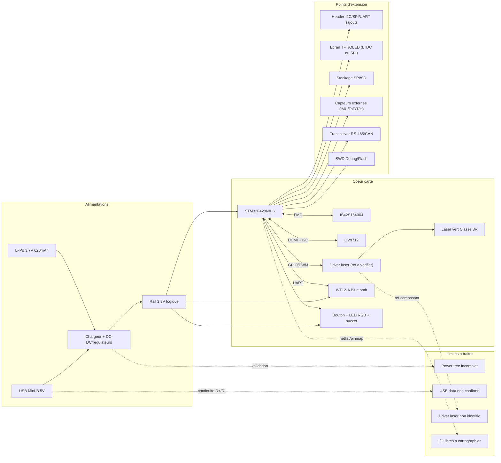

# Phase 2 - Champ des possibles (reemploi + extensions)

Objectif: cartographier de facon exhaustive ce qui est reutilisable, ce qui est ajoutable, les limites fonctionnelles, et les points de connexion concrets pour soutenir la phase d'ideation.

Convention de statut:
- [confirme] observe dans la retro-ingenierie et coherent avec les references relevees.
- [probable] tres plausible selon architecture STM32F429 + composants identifies, validation electrique conseillee.
- [a verifier] necessite mesure, test de continuite, ou identification de composant.

## 1. Capacites du produit en l'etat (reutilisable)

### 1.1 Fonctions materielle directement reutilisables

| Domaine | Fonction | Blocs impliques | Interfaces | Statut |
|---|---|---|---|---|
| Acquisition optique | Capture image surface | OV9712 + STM32 DCMI + SDRAM | DCMI, I2C/SCCB, FMC | [confirme] |
| Mesure laser | Projection laser impulsionnelle | Diode laser + driver + STM32 | GPIO/PWM/Enable | [confirme]/[a verifier ref driver] |
| Traitement embarque | Controle capteurs et logique metier | STM32F429NIH6 | GPIO, timers, DMA, IRQ | [confirme] |
| Memoire de travail | Tampons image et buffer temps reel | IS42S16400J | FMC SDRAM 16-bit | [confirme] |
| Liaison sans fil | Echange de donnees vers hote | WT12-A | UART TTL 3.3V | [confirme] |
| Energie portable | Fonctionnement autonome | Li-Po LP602248 + power tree | VBAT, 3.3V rails derives | [confirme] |
| Interface locale | Interaction operateur simple | Bouton, LED RGB, buzzer | GPIO/PWM | [confirme] |
| Maintenance/flash | Programmation/debug | Pads SWD (+ USB OTG potentiel) | SWDIO/SWCLK, USB D+/D- | SWD [confirme], USB data [a verifier] |

### 1.2 Ressources MCU exploitables (STM32F429)

| Ressource | Valeur exploitable pour reemploi | Etat d'usage actuel |
|---|---|---|
| CPU | Cortex-M4F jusqu'a 180 MHz | Utilise |
| RAM interne | 256 Ko SRAM | Utilisee |
| Flash interne | 2 Mo | Utilisee |
| DCMI | Interface camera parallele native | Utilisee |
| FMC | Interface SDRAM externe | Utilisee |
| LTDC | Pilotage ecran TFT RGB | Potentiellement libre/partielle |
| USB OTG FS | USB maintenance, data, DFU | [a verifier routage] |
| UART multiples | Console debug, BT, extension serie | Au moins 1 utilise (WT12) |
| SPI / I2C | Extensions capteurs, affichage, stockage | Partiellement libres [probable] |
| Timers/PWM | Controle buzzer, LED, laser, moteurs | Partiellement libres [probable] |
| ADC | Mesure batterie/capteurs analogiques | Disponibilite [probable] |

## 2. Ce qui peut etre ajoute (champ d'extension)

### 2.1 Extensions realistes par bus

| Extension ajoutee | Bus/liaison recommandee | Point de raccordement cible | Gain fonctionnel | Contraintes |
|---|---|---|---|---|
| Ecran TFT local | LTDC RGB (prioritaire) ou SPI | GPIO/LTDC du STM32 via nappe/add-on | IHM autonome sans PC | Budget conso, mecanique boitier |
| Ecran compact OLED/TFT | SPI + GPIO | Header extension 3.3V | Affichage etat/mesures | Bande passante limitee vs LTDC |
| IMU (accel/gyro) | I2C | Bus extension I2C | Stabilisation mesure / orientation | Calibration |
| ToF/Lidar court portee | I2C/UART | Bus extension 3.3V | Mesure distance complementaire | Integrite optique, puissance |
| Stockage local | SPI (NOR/FRAM/SD via SPI) | SPI libre + CS dedie | Journalisation locale | Protection ecriture/coupure |
| BLE/Wi-Fi passerelle | UART/SPI | UART secondaire ou SPI | Connectivite moderne / cloud | Conso et securite |
| CAN transceiver | CAN (si dispo) ou UART->CAN | Header extension | Integration vehicule/atelier | Verification broches CAN |
| RS-485 | UART + transceiver | UART + GPIO DE/RE | Liaison robuste industrielle | Isolation EMC |
| GPIO expander | I2C | Bus I2C extension | Plus d'entrees/sorties | Latence I2C |
| Capteur temperature/humidite | I2C/1-Wire | Header extension | Compensation mesure environnementale | Validation metrologique |
| Entree trigger externe | GPIO interrupt | Pad test ou header | Synchronisation avec banc externe | Filtrage anti-rebonds/EMI |

### 2.2 I/O disponibles non utilisees (a confirmer sur carte)

| Famille I/O | Potentiel d'usage | Niveau logique | Statut |
|---|---|---|---|
| GPIO libres | relais faibles, trigger, status, capteurs TOR | 3.3V | [probable] |
| UART libres | debug, modem externe, RS-485 | 3.3V TTL | [probable] |
| I2C libres | capteurs, expander, RTC | 3.3V open-drain + pull-up | [probable] |
| SPI libres | memoire externe, ecran, ADC rapide | 3.3V | [probable] |
| PWM/Timers libres | commande laser fine, ventilateur, servo | 3.3V sortie logique | [probable] |
| ADC libres | supervision VBAT, NTC, capteurs analogiques | 0-3.3V max (adapter) | [probable] |
| LTDC | ecran couleur | domaines selon dalle | [probable] |

## 3. Limites fonctionnelles (techniques, securite, integration)

### 3.1 Limites materielle

| Limite | Impact sur ideation | Niveau |
|---|---|---|
| Driver laser non identifie | Difficulte a garantir pilotage fin/safe par firmware | Critique |
| Flash Micron non decodee | Incertitude capacite stockage externe et timing bus | Majeur |
| Arbre d'alim incompletement identifie | Risque sous-dimensionnement pour modules ajoutes | Critique |
| USB data non confirme | Limite scenarios de maintenance/telemetrie USB | Majeur |
| Nombre exact d'I/O libres inconnu | Risque de surestimation des extensions simultanees | Majeur |
| Boitier compact existant | Contraintes mecaniques/thermiques pour modules additionnels | Majeur |

### 3.2 Limites energie et performances

| Limite | Ordre de grandeur | Impact |
|---|---|---|
| Courant dispo sur rail 3.3V inconnu | A mesurer sous charge | Peut bloquer ajout radio/ecran |
| Batterie 620 mAh | Autonomie chute vite >250 mA | Prioriser duty-cycle et veille |
| Charge thermique locale | Sources: laser, DC-DC, radio | Risque derive mesure et fiabilite |
| RAM/CPU sollicites en vision | Traitement image couteux | Limiter complexite IA embarquee |

### 3.3 Limites conformite et securite

| Sujet | Contrainte | Effet sur ajout |
|---|---|---|
| Laser classe 3R | Obligations de securite oculaire et interlocks | Ajouter coupure hardware recommandee |
| CEM/EMI | Nouveaux modules peuvent degrader signal camera/BT | Filtrage, blindage, routage propre |
| Batterie Li-Po | Courants de pointe et charge securisee | Protection et supervision obligatoires |
| Radio BT classique | Pas BLE natif WT12-A | Limite compatibilite smartphone moderne |

## 4. Points d'extension physiques (ou connecter les ajouts)

| Zone carte | Type de point | Ce qu'on peut y brancher | Verification requise |
|---|---|---|---|
| Pads SWD | Debug/flash | ST-Link, trace, dev firmware | Niveau RDP, integrite pads |
| USB Mini-B | Alim + data potentielle | Maintenance, logs, DFU, USB-CDC | Continuite D+/D- vers MCU |
| Nappe camera | Bus image + config | Capteur compatible DCMI | Pinout et tensions camera |
| Zone WT12/UART | Serie 3.3V | Module comm additionnel/pass-through | Collision UART avec BT natif |
| Pads GPIO test | I/O diverses | Trigger, capteurs TOR, sortie statut | Mapping exact des broches |
| Rail 3.3V test | Alimentation extension | Modules faible conso | Marge courant reelle |
| Zone UI | Bouton/LED/buzzer | IHM alternative ou enrichie | Resistances serie, drivers |

## 5. Schéma fonctionnel Phase 2 (etat + ajoutable)

Ce schema montre en meme temps:
- les fonctions existantes,
- les points d'extension,
- les modules ajoutables,
- les limites principales.

## 6. Matrice ideation: faisabilite d'ajouts (court terme)

| Idee d'ajout | Faisabilite | Complexite | Risque principal | Decision Phase 2 |
|---|---|---|---|---|
| Ecran SPI de statut | Haute | Faible | I/O disponibles | Garder |
| Journalisation sur memoire SPI | Haute | Faible a moyenne | Integrite alim/ecriture | Garder |
| Capteurs I2C additionnels | Haute | Faible | Adresse bus/conflits | Garder |
| RS-485 industriel | Moyenne | Moyenne | Isolation/EMC | Garder sous condition |
| BLE/Wi-Fi additionnel | Moyenne | Moyenne a elevee | Conso/securite | Garder sous condition |
| IA embarquee lourde | Faible a moyenne | Elevee | CPU/RAM/energie | Ecarter en V1 |
| Ecran TFT complet LTDC | Moyenne | Elevee | Routage + puissance | Garder V2 |

## 7. Actions de cloture Phase 2 (avant ideation)

1. Relever la pinmap reelle des I/O libres sur carte (continuite + firmware test).
2. Identifier les references CI d'alimentation et driver laser.
3. Valider USB D+/D- (enumeration test) et confirmer usage data.
4. Mesurer marges courant sur 3.3V en scenarii charge.
5. Geler une liste de 3 a 5 architectures candidates pour la phase d'ideation.
